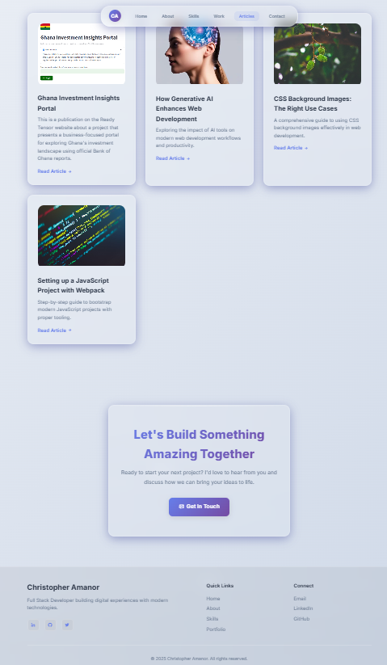

## Portfolio Website

A modern, high-performance portfolio website showcasing projects, writing, and experience. The site features a 2025-inspired UI with liquid glass (glassmorphism), smooth animations, and responsive design, built with semantic HTML, modern CSS, and lightweight JavaScript.

Live site: https://krys2fa.github.io

### Screenshots

<div align="center">

<table>
	<tr>
		<td align="center">
			<br/>
			<sub><b>Home</b></sub>
		</td>
		<td align="center">
			<br/>
			<sub><b>About & Skills</b></sub>
		</td>
	</tr>
	<tr>
		<td align="center">
			<br/>
			<sub><b>Projects & Articles</b></sub>
		</td>
		<td align="center">
			<br/>
			<sub><b>Contact</b></sub>
		</td>
	</tr>
  
</table>

</div>

### Key Features

- Liquid glass UI with soft shadows, blur, and depth
- Animated background with floating particles/shapes
- Smooth scroll, section reveal, and scroll progress indicator
- 3D tilt and ripple effects on interactive elements
- Responsive design for mobile, tablet, and desktop
- Project gallery with overlays and external links
- Publications/articles section
- Accessible, semantic structure and keyboard-friendly interactions
- Uses profile picture as site favicon

### Tech Stack

- HTML5, CSS3 (Flexbox, Grid, variables, backdrop-filter)
- Vanilla JavaScript (IntersectionObserver, performance/throttle patterns)
- Fonts: Inter (Google Fonts)
- Icons: Boxicons

### Project Structure

- `index.html` — Main site entry
- `index_new.html` — Alternate entry (same content, experimental layout)
- `assets/css/styles.css` — Global styles (glassmorphism, animations, responsive)
- `assets/js/main.js` — Interactions (nav, scroll/typing effects, particles, tilt)
- `assets/images/` — Images (profile and project assets)
- `images/` — Legacy/static assets used in sections

### Sections

- Hero (intro, actions, social links)
- About (bio, role, stats)
- Skills (development, tooling, professional)
- Portfolio (featured projects with tech badges and links)
- Publications (articles/resources)
- Contact (email CTA)

## Getting Started

### Prerequisites

No build tools required. Any static web server or direct file open works.

### Run Locally

Option 1 — Open directly:

- Double-click `index.html` to open in your browser.

Option 2 — Serve locally (recommended for smooth routing and assets):

```powershell
# Python (if installed)
python -m http.server 8000

# Then open:
http://localhost:8000
```

### Deploy

This repository is configured for GitHub Pages via the `master` branch:

- Push changes to `master`
- Live site updates at: https://krys2fa.github.io

## Customization

### Update Profile and Favicon

- Profile image: `assets/images/profile-pic.jpeg`
- Favicon uses the same profile image (linked in the `<head>` of `index.html`). Replace the file to update both.

### Edit Content

- Hero/About text: in `index.html`
- Skills: update the `.skill-list` tags per category
- Projects: edit the cards in the Portfolio section (image, title, description, tech, links)
- Publications: update cards in the Publications section

### Add Project Cards

Duplicate a `.project-card` block in the Portfolio section and update:

- Image source: `assets/images/...`
- External link(s): demo and GitHub
- Tech stack badges inside `.project-tech`

### Styling

Global theme tokens and effects live in `assets/css/styles.css`:

- Colors and gradients: `:root` CSS variables
- Glassmorphism: `.glass-card`, `.glass-nav` rules
- Animations: `@keyframes` and `.animate-on-scroll`

## Accessibility & Performance

- Uses semantic HTML and readable color contrast
- Animations favor CSS transforms for GPU acceleration
- IntersectionObserver used for efficient scroll-triggered effects
- Images can be lazily loaded via `data-src` pattern supported in `main.js`

## SEO

- Update the `<title>` and add meta description in `index.html`
- Add Open Graph/Twitter meta tags if sharing previews are needed

## Maintenance

- Keep dependencies (fonts/icons) CDN links current
- Compress images placed under `assets/images/` for faster loads
- Review links (resume, projects) periodically for freshness

---

Questions or improvements? Open an issue or reach out via email: christopher.k.amanor@gmail.com.
